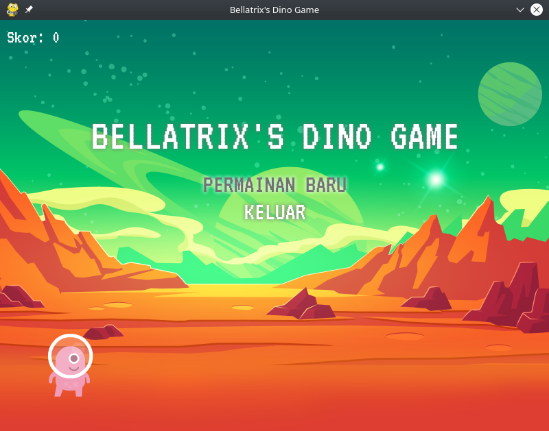
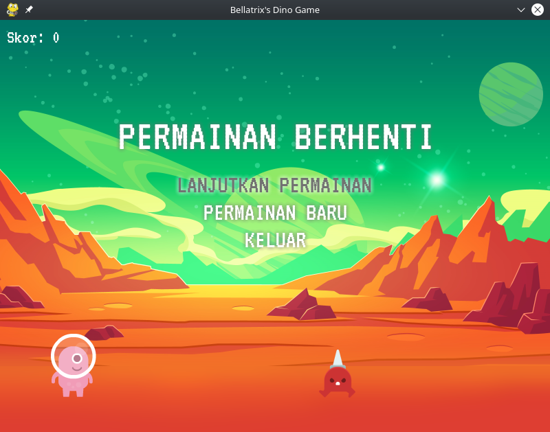
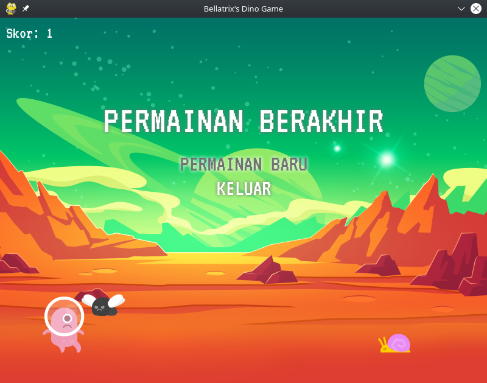

# dino-pygame
Chrome's dino game implemented using Pygame

## How to use?
1. Make sure you have Git, Python, and Pygame installed
2. Create an empty folder (e.g. `D:/Project/dino-pygame`)
3. Open terminal or command prompt or whatever
4. Change the directory to previously created folder (use `cd D:/Project/dino-pygame`)
5. Use `git init` to create an empty repository
6. Use `git remote add <name> https://github.com/AndhikaWB/dino-pygame.git`
7. Use `git pull <name> <branch-name>` (available branch: master, devel)
8. Done, just run `main.py` to launch dino game

## Other notes
Codes in `master` branch were written in English (except the comments).  
Codes in `devel` branch are currently written in Bahasa Indonesia.

## Screenshots

## Credits
Most graphic assets were taken from [Kenney](https://www.kenney.nl/).  
VT323 font (by Peter Hull) was taken from [Google Fonts](https://fonts.google.com/specimen/VT323).